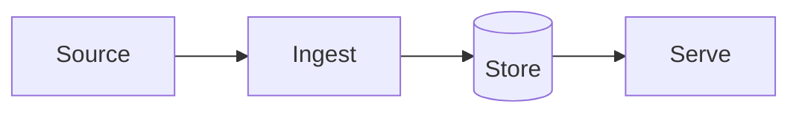

<!--
README TEMPLATE — fill every section, delete these comments.
Order matters: a reviewer reads top to bottom for about thirty seconds,
so the demo and the value proposition sit above the fold.
-->

# PROJECT_NAME

> ONE_LINE_VALUE_PROP — what it does and who it is for, in under twenty words.
> Example: "Config-driven lakehouse ingestion — onboard a new source with one SQL row, not a new pipeline."

[](https://github.com/Pranay777777/REPO/actions/workflows/ci.yml)


[](LICENSE)

**[Live demo →](DEMO_URL)**

<!-- Demo GIF or screenshot goes here, above the fold. Non-negotiable.
     Record with ScreenToGif (Windows) or LICEcap. Keep it under 10 seconds
     and under 5 MB. Show the thing working, not the code. -->


---

## The problem

Two or three sentences. What breaks without this? Who feels the pain?
Write for someone who has never seen the domain. Resist describing the
solution here — that comes next.

## Architecture



One paragraph walking through the flow, naming the non-obvious parts.

## Quickstart

Five commands or fewer, from nothing to running:

```bash
git clone https://github.com/Pranay777777/REPO.git && cd REPO
cp .env.example .env
make install
make up
make test
```

Then open http://localhost:8000/docs

> Runs fully locally — no cloud account required.

## How it works

The mechanics worth explaining. Skip what any reader could guess; spend the
space on the parts you would have to explain out loud in an interview.

## Design decisions and tradeoffs

<!-- The highest-value section in this file. Four to six entries.
     Every one names what you gave up. An entry with no cost is marketing. -->

**Why X over Y?**
Needed <requirement>. Chose X because <reason>. Cost: <what it made worse>,
mitigated by <mitigation>.

**Why not Z?**
<Honest reason. "Too slow to build" is a legitimate answer.>

## Results

Real numbers. A table beats adjectives.

| Metric | Value | How measured |
|---|---|---|
| Throughput | X rows/sec | `make bench`, n=3 |
| Latency p95 | X ms | … |
| Cost | $X per unit | … |

## Limitations

What this does not do, where it breaks, what would need to change for
production use. Being specific here reads as confidence, not weakness.

## Roadmap

- [ ] Next thing
- [ ] Thing after that

## Project structure

```
src/app/          application code
  config.py       typed settings — nothing reads os.environ directly
  logging.py      structured JSON logging
tests/            unit and integration tests
docs/adr/         architecture decision records
.github/workflows CI: lint, types, tests, security, docker
```

## Development

```bash
make help         # list every target
make format lint typecheck test security
```

Gates: `ruff`, `mypy --strict`, `pytest` at 70% coverage minimum, `gitleaks`
over full history, and `pip-audit`. CI runs all of them on every push.

## License

MIT — see [LICENSE](LICENSE).
